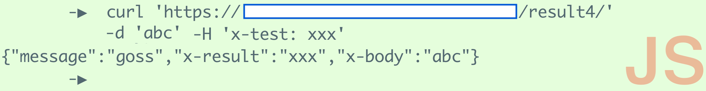

## Практическое задание 4

#### Этот элемент курса оценивается как 'Практическая работа'
вес: 6.0

#### до 23 нояб. 2020 г. 00:00 MSK

Добавить страницу в мои закладки

Hello! Your score: 1 (click the button to try).

hessian

## Задание этой недели:

Создайте и запустите веб\-приложение, выдающее заголовки, разрешающие кроссдоменный доступ в ответ на любой запрос, которое по маршруту /result4/ возвращает JSON\-объект со следующими свойствами:
A. message со значением: **hessian**

Б. x\-result со значением, равным значению заголовка x\-test из запроса.
В. x\-body со значением, равным значению тела запроса.

Т.е. проверяющий сценарий должен получить JSON вида {"message":"goss","x\-result":"yyyyy","x\-body":"zzzzz"}

При этом должен возвращаться заголовок Content\-Type со значением application/json

Заголовок x\-test должен быть разрешён в заголовке ответа Access\-Control\-Allow\-Headers.

Приложение должно разрешать все методы по CORS и реагировать на них одинаково

Access\-Control\-Allow\-Origin: \*
Access\-Control\-Allow\-Methods: GET,POST,PUT,DELETE,OPTIONS
Access\-Control\-Allow\-Headers: x\-test,Content\-Type,Accept,Access\-Control\-Allow\-Headers

Как и в предыдущих заданиях, все маршруты должны заканчиваться слэшем.

